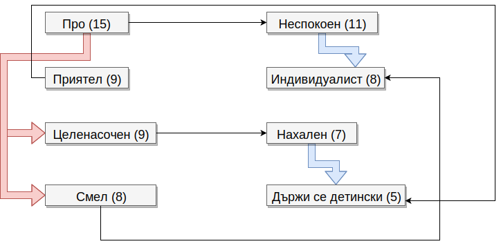

# Как и като какъв аз мисля себе си? Каква претенция имам към другите? Как мисля, че ме приемат?

Колкото и да ми се иска, не мога да имам еднакво поведение към хора с различно отношение към мен. Това ме кара да „избухвам“ на моменти, които в повечето случаи са непредвидими, което пък може би кара хората да ме мислят за импулсивен (не, това е просто натрупване на напрежение). 

Въпреки това, за себе си мога да кажа, че съм идеалист - човек с възгледи, които отстоявам до край и почти на всяка цена. Не крия, че това мнение често е противоположно на общоприетото. Но пък това ми е характерът, такъв съм и то не защото трябва или защото мразя света, а защото смятам, че е редно и нормално да сме различни, а не да сме „стада“.

Всъщност може би това отстояване на мнението ми се приема от околните по-скоро като опит за „налагане на мнението ми“, но всъщност не е опит за доминация по дадена тема, а за „проповядване“ на представата ми за идеално, прогресиращо и креативно общество.

Друг интересен аспект е това, че аз уверено заявявам, че имам представа какъв съм. Това се дължи по-скоро на умението да наблюдавам и анализирам поведения, което пък се роди след един доста голям период от време, в който не исках и не се социализирах заедно с останалите от класа. Не съжалявам за това, защото ми даде възможност да „порастна“, т.е. да се осъзная и да стана по-зрял от връсниците ми. От друга страна, когато не си социален, съдиш за другите по-скоро по себе си, което ми даде една илюзионна представа за другите, че мислят зряло.

# Коментар върху външни мнения (съученици и близки).
`` Тук може да защитите и/или утвърдите образа/метода?/си ``

След като изясних какъв искам и къкъв смятам, че съм, е време да погледнем за какъв ме мислят другите. Ще започна с един  честотен съдържателен анализ на използваните определения:

\+ | Срещания | - | Срещания
--- | --- | --- | ---
про... | 15 | неспокоен | 11
приятел | 9 | индивидуалист | 8
целенасочен | 9 | нахален | 7
смел | 8 | държи се детински | 5
забавен | 6 | сложен | 4
старателен | 2 | инат | 3
искрен | 2 | нестандартен | 2
разумен | 2 | твърде прям | 2 
 | | | енигматичен | 1
 | | | твърде отдаден | 1
 | | | враг | 1
**Общо** | **8 (53)** | **Общо** | **11 (45)** 

<small>Критерият „про...“ обединява определения като „добър програмист“, „добър математик“, „с ясно мнение за себе си“ и „пробивен“.</small> 

Базирайки се на правилото, че всяко развито положително качество си има и развито отрицателно такова, взимам първите 4 от всяка категория (+ и -). Ето мисловна карта на тези качества с връзките между тях според мен:

Връзките от своя страна представляват думата „защото“ („Аз съм __смел__, защото съм __индивидуалист__.“ и обратното). Остава един въпрос - „Аз съм __(добър) приятел__, защото съм <b>...</b>“. По метода на изключването остава „... защото се държа детински“, но това не звучи най-логичното нещо. Този въпрос остава отворен. Макар, че има известна доза вярност, защото:
* ако си сериозен, не можеш да оцелееш в света на чувствата
* ако си „лигав“, не можеш да оцелееш в материалния свят

Както във всичко останало и тук трябва баланс, тъй че може би тази връзка не е съвсем нелогична.

# Самооценка. Къде виждам възможности? Понятност за себе си. До колко личната ми представа е реална и защо?

От чуждото мнение основно се потвърждава моето лично мнение за самия мен. Неочакван страничен ефект е определението „държи се детински“. То по-скоро идва от ескалирането на напрежението, за което споменах по-рано.

Определенията „инат“ и „нестандартен“ са по-скоро подхранващи за „индивидуалист“, а останалите отрицателни определения имат незначителен дял за цялостната представа за мен. Колкото до положителните определения, аз лично не съм си и представял съучениците ми да пишет за мен, че съм „забавен“ или „старателен“, което е ... поне за мен първоначално бе стряскащо и по-скоро показва една ниска или дори песемистична представа за самия мен (изобщо не е сигурно, че съм такъв, но ако съм?). Очаквах повече мнения за „искрен“ и „разумен“, макар, че те са по-скоро включени в „целенасочен“, „смел“ и „приятел“.
